# 21/10/21 Java lesson

## What I learned(Important)

* if else statement

## What I studied myself

[more information](http://blog.naver.com/sharon0a/110046003657)

* RDBMS(Relational DataBase Management System)
  * can define only simple things like word, number, date and can't make new type
  * using SQL(Structured Query Language)
* ORDBMS(Object-Relational DataBase Management System)
  * can define new type by user
  * using extended SQL
  * slower then RDBMS dealing with data(searching, adding, ...etc)
* OODBMS(Object-Oriented DataBase Management System)
  * can define new type and method by user
  * using OQL(Object Query Language)
  * a lot more slower then RDBMS dealing with data(searching, adding, ...etc)
* ORM(Object Relational Mapping)
  * Used to map between OOP(Object Oriented Programming) and RDBMS
  * I guess OODBMS doesn't need to use ORM

## What I didn't understand

## What I want to know more

* [making web system](https://pythonblog.co.kr/blog/61/) with Nginx(Web Server), Gunicorn(WSGI, same as Web Server Gateway Interface,
    Django(WAS, same as Web Application Server)
  * [more imformation with Web server, WSGI, WAS](https://jay-ji.tistory.com/66)
  * will add Database with(PostgreSQL(ORDBMS) or Mysql(RDBMS))

## etc(Additional)

## Practice problems

* [Quiz01.java](Quiz01.java)
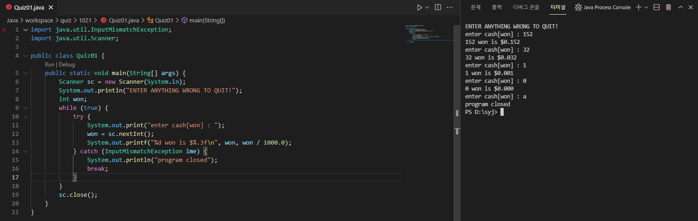

* [Quiz02.java](Quiz02.java)
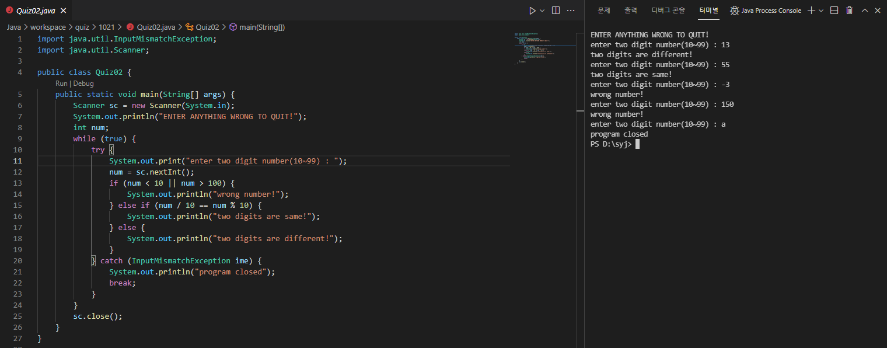

* [quiz03.java](quiz03.java)
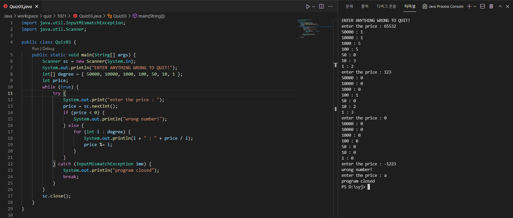

* [Quiz04.java](Quiz04.java)
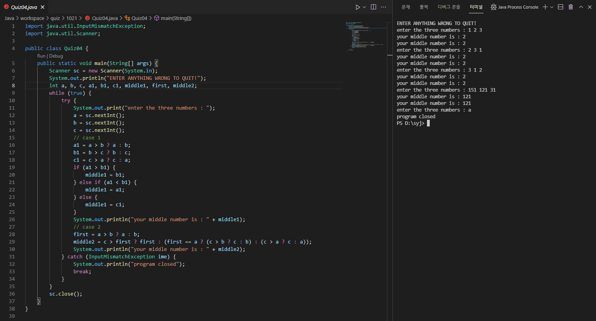

* [Quiz05.java](Quiz05.java)
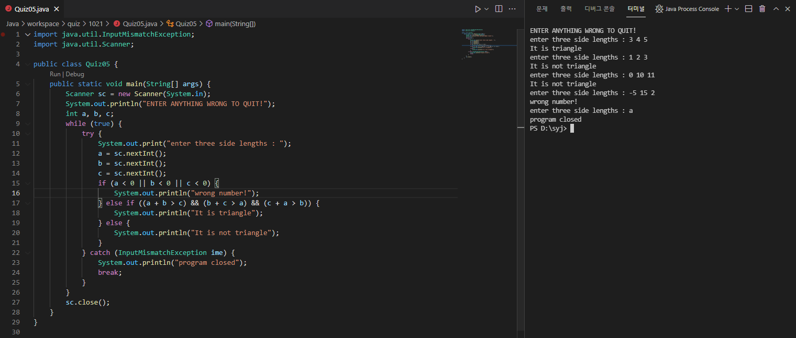

* [Quiz06.java](Quiz06.java)
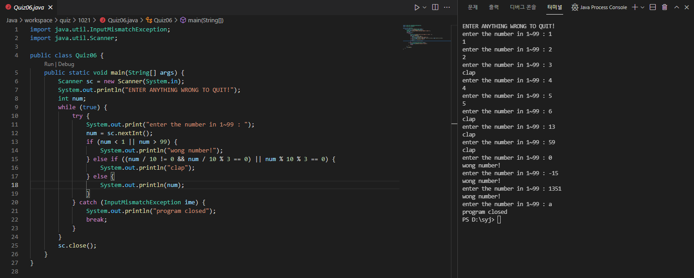

* [Quiz07.java](Quiz07.java)
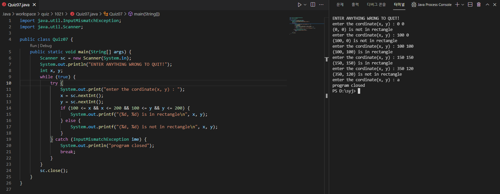

* [Quiz08.java](Quiz08.java)
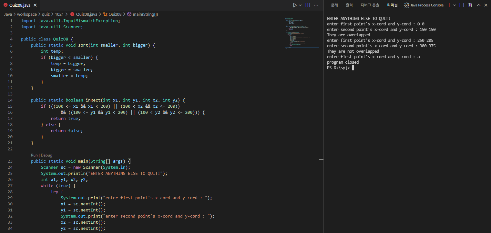
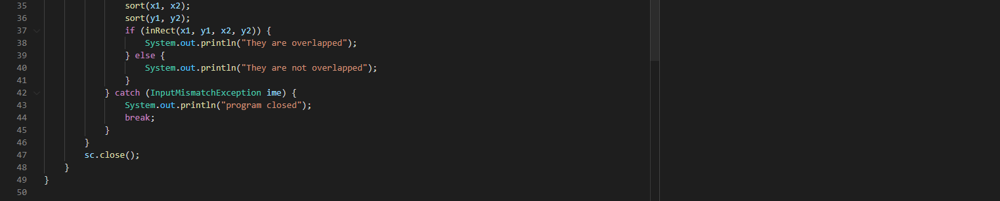

* [Quiz09.java](Quiz09.java)
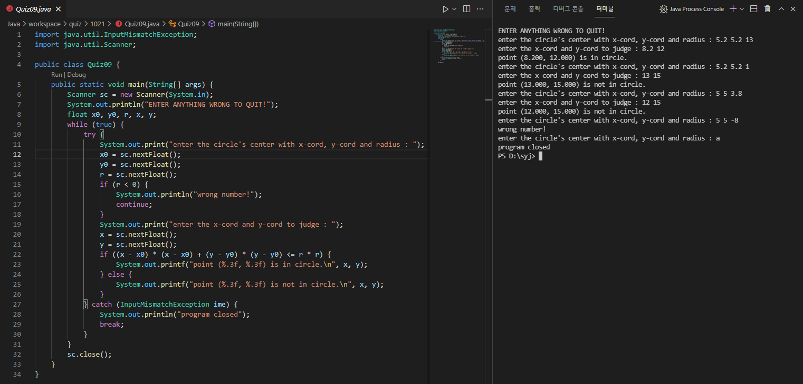

* [Quiz10.java](Quiz10.java)
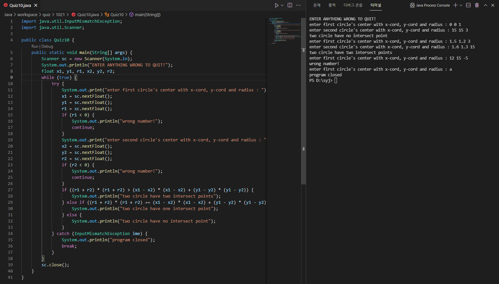

* [Quiz11.java](Quiz11.java)
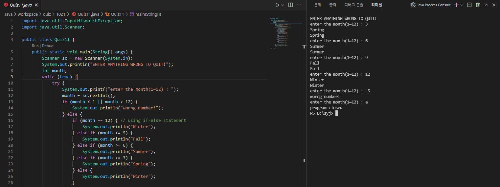
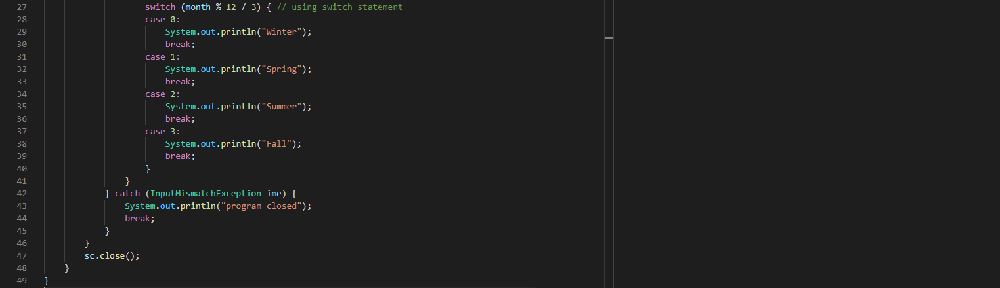

* [Quiz12.java](Quiz12.java)
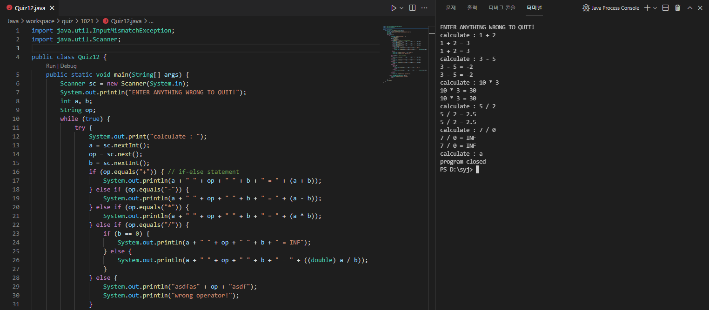
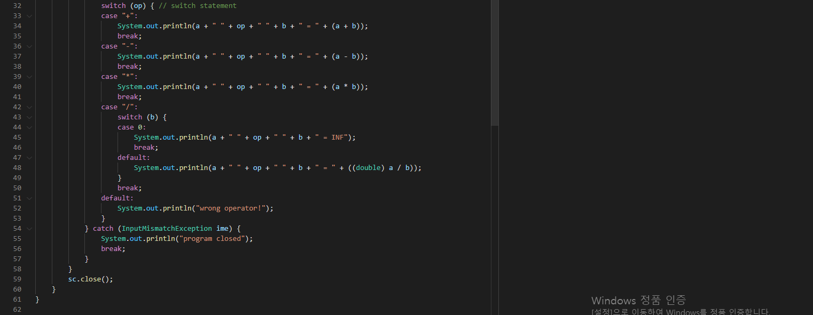

* [QuizOpen.java](QuizOpen.java)
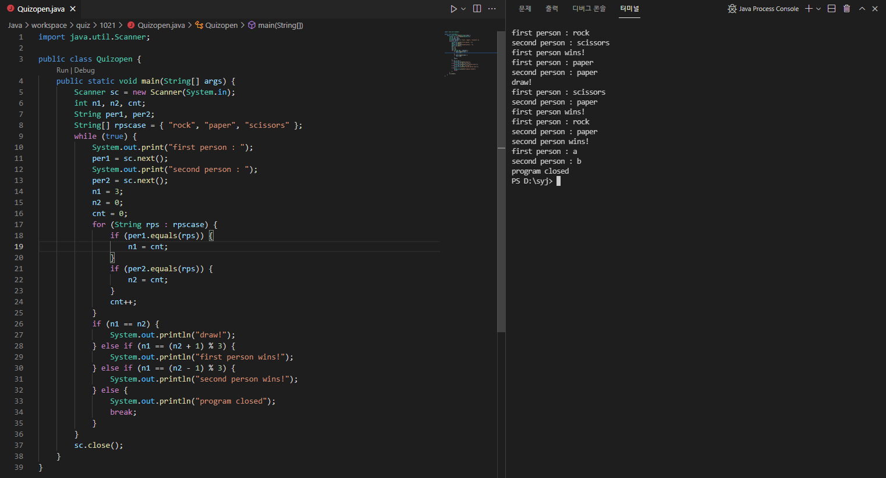
