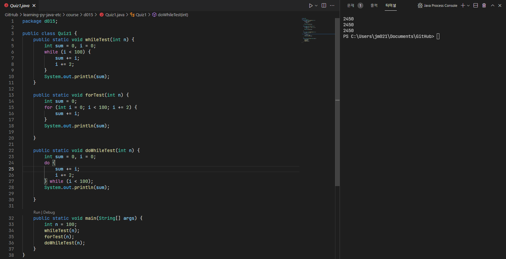
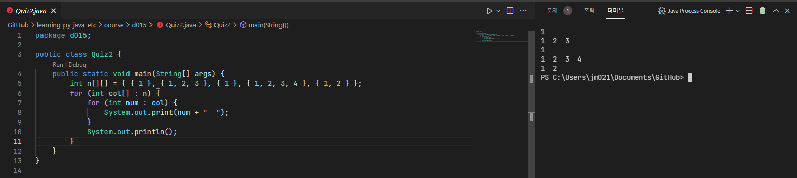
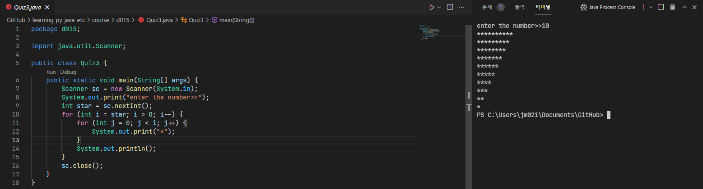
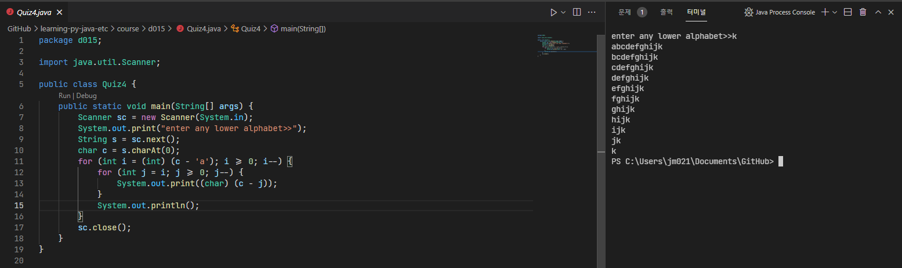
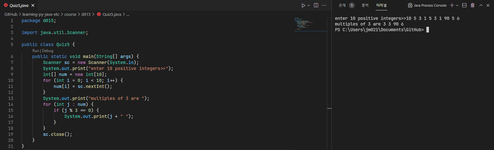
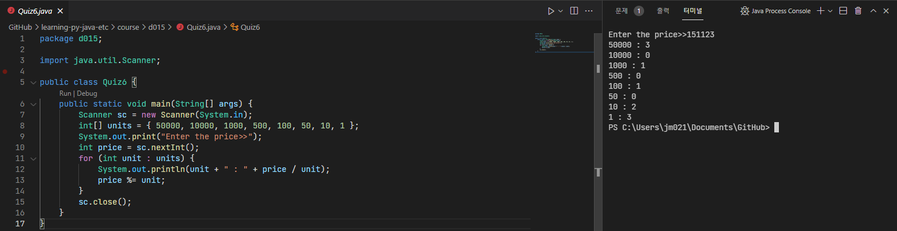
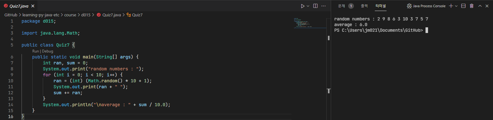
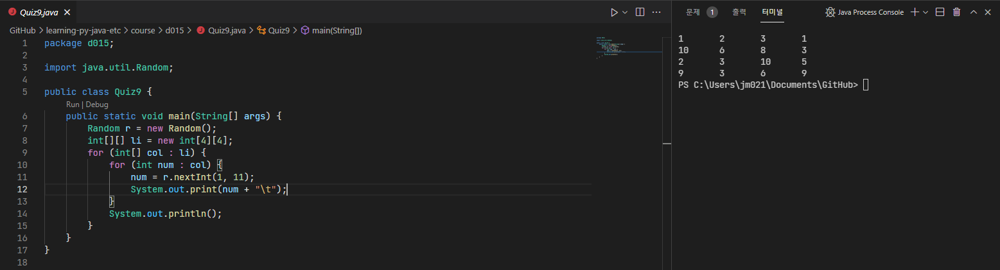
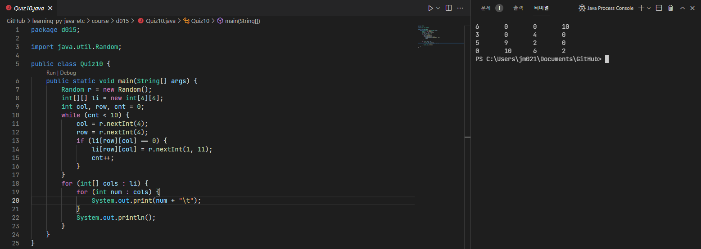

# 21/10/26 Java lesson

## What I learned(Important)

* for statement (example : [ForSample.java](ForSample.java), [NestedLoop.java](NestedLoop.java))
  * how to use:

  ```java
  for($inital-state$ ; $condition$ ; $state-change$) {
    $action$
  }
  ```
  
  * statement order:  
    1. $inital-state$
    2. $condition$
    3. if true: $action$ -> $state-change$, if false: **ended**
    4. if **not ended**: go to 2.

* while statement (example : [WhileSample.java](WhileSample.java))
  * how to use:

  ```java
  while($condition$) {
    $action code$
  }
  ```

* do-while statement
  * how to use:

  ```java
  do {
    $action code$
  } while($condition$); // you MUST ended with semicolon!
  ```

* continue and break
  * how to use:

* array

## What I studied myself

*
  *
* .... (Studying)
  *
*
*
* .... (Studied)
  *

## What I didn't understand

* what is in array reference variable?
  * just memory location or plus array number
  * can overwrite other memory?
  
*
*

## What I want to know more

* .... (Solving)
  *
* .... (Solved)

## etc(Additional)

*
*
*

## Practice problems

* [Quiz01.java](Quiz01.java)


* [Quiz02.java](Quiz02.java)


* [quiz03.java](quiz03.java)


* [Quiz04.java](Quiz04.java)


* [Quiz05.java](Quiz05.java)


* [Quiz06.java](Quiz06.java)


* [Quiz07.java](Quiz07.java)


* [Quiz08.java](Quiz08.java)


* [Quiz09.java](Quiz09.java)


* [Quiz10.java](Quiz10.java)


* [Quiz11.java](Quiz11.java)


* [Quiz12.java](Quiz12.java)


* [QuizOpen.java](QuizOpen.java)

