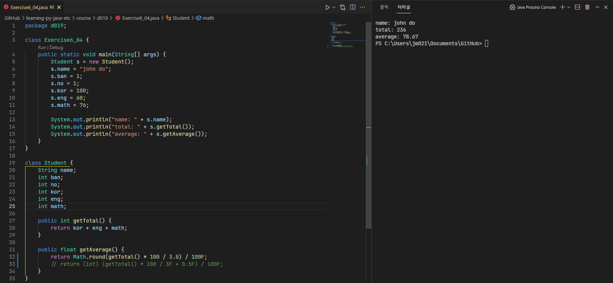
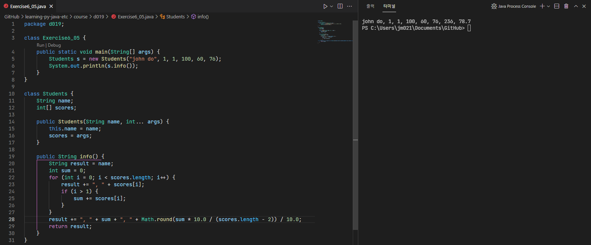
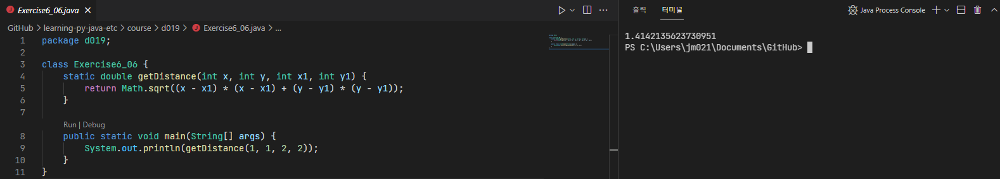
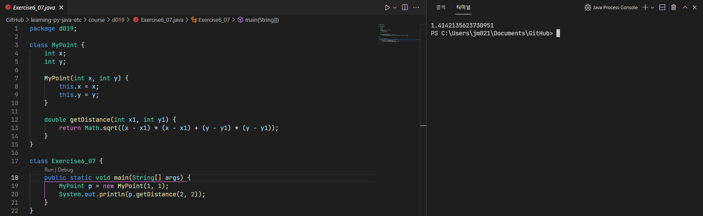
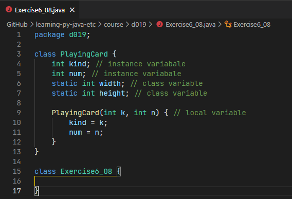
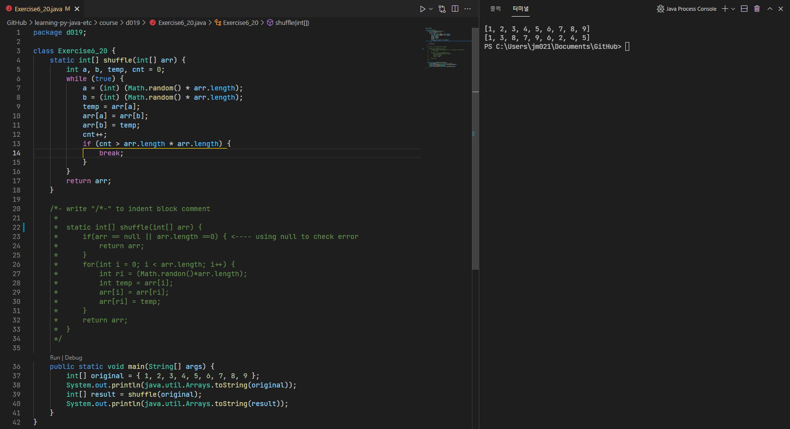
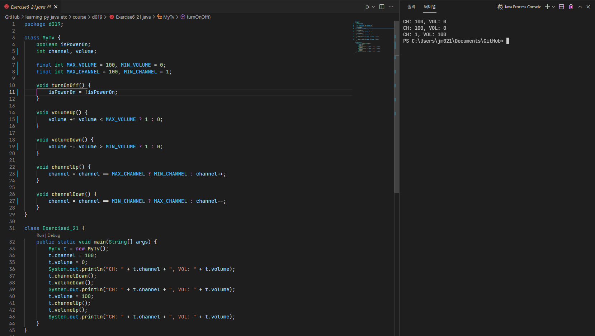
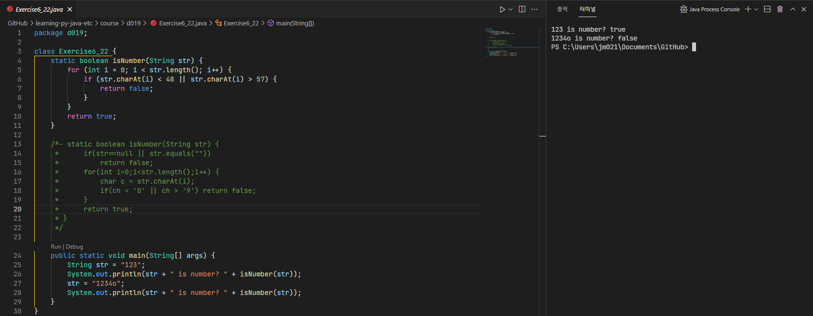
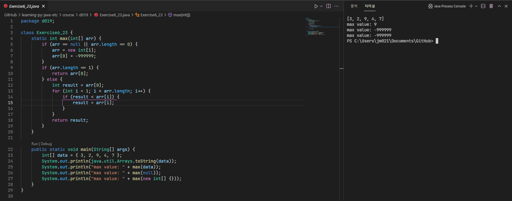
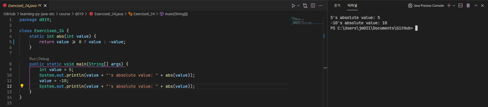

# 21/11/01 Java lesson

## What I learned(Important)

* [What is class?](https://docs.oracle.com/javase/specs/jls/se17/html/jls-8.html)
* What is class array? ([BookArray.java](BookArray.java))
  *
* What is reference type and primitive type?
  * Reference type ([Circle.java](Circle.java))
    * class that is mutable
    * when the value is changed, it's memory address don't need to be changed
  * Primitive type
    * when the value is changed, it's memory address should be changed to changed values memory address pointer

## What I studied myself

## What I didn't understand

* (in [BookArray.java](BookArray.java)) Why already declared variable moves to different memory address for each value change?
* Is there any difference with only value add and value add with declare variable?

## What I want to know more

## etc(Additional)

## Useful links

<https://www.geeksforgeeks.org/java/?ref=shm>

## Practice problems

### ([Exercise6_02.java](Exercise6_02.java))

### ([Exercise6_04.java](Exercise6_04.java))

### ([Exercise6_05.java](Exercise6_05.java))

### ([Exercise6_06.java](Exercise6_06.java))

### ([Exercise6_07.java](Exercise6_07.java))

### ([Exercise6_08.java](Exercise6_08.java))

### ([Exercise6_09.java](Exercise6_09.java))

### ([Exercise6_20.java](Exercise6_20.java))

### ([Exercise6_21.java](Exercise6_21.java))

### ([Exercise6_22.java](Exercise6_22.java))

### ([Exercise6_23.java](Exercise6_23.java))

### ([Exercise6_24.java](Exercise6_24.java))

