# 21/11/02 Java lesson

## What I learned(Important)

* [Access Control with access modifier](https://docs.oracle.com/javase/specs/jls/se17/html/jls-6.html#jls-6.6)
  * private
  * default
  * protected
  * public

* [static class](https://docs.oracle.com/javase/specs/jls/se17/html/jls-8.html#jls-8.1.1.4)

## What I studied myself

### [Primitive data types](https://docs.oracle.com/javase/specs/jls/se17/html/jls-4.html#jls-4.2)

([easier version](https://docs.oracle.com/javase/tutorial/java/nutsandbolts/datatypes.html))

* byte: 8-bit [signed two's complement integer](https://m.blog.naver.com/PostView.naver?isHttpsRedirect=true&blogId=ecomarinesys&logNo=220600191718)(can denote number -2^8 to 2^8-1)
* short: 16-bit signed two's complement integer
* int(default type in int): 32-bit signed two's complement integer
* long: 64-bit signed two's complement integer
* float: single-precision 32-bit IEEE 754 floating point
* double(default type in float-point number): double-precision 64-bit IEEE 754 floating point
* boolean: store true or false
* char: single 16-bit Unicode character(can represent \u0000(or 0) to \uffff(or 65535))

### [Type conversion](https://docs.oracle.com/javase/specs/jls/se17/html/jls-5.html))

([easier version](https://stage-loving-developers.tistory.com/8))

* [Promotion](https://docs.oracle.com/javase/specs/jls/se17/html/jls-5.html#jls-5.1.2)
  * byte(1) < short(2) < int(4) < long(8) < float(4) < double(8)
  * unit is byte(8-bit)
  * [Why long type can promote to float](https://stackoverflow.com/questions/1293819/why-does-java-implicitly-without-cast-convert-a-long-to-a-float)
  * [Numeric Promotion](https://docs.oracle.com/javase/specs/jls/se17/html/jls-5.html#jls-5.6)
    * in uanry operation, byte, short, char promotes to int
    * if two operands in binary operator have different type each, widening primitive conversion happens
* [Casting](https://docs.oracle.com/javase/specs/jls/se17/html/jls-5.html#jls-5.5)
* [String Conversion](https://docs.oracle.com/javase/specs/jls/se17/html/jls-5.html#jls-5.1.11) #here
  * [String conversion applies only to an operand of the binary + operator which is not a String when the other operand is a String.](https://docs.oracle.com/javase/specs/jls/se17/html/jls-5.html#jls-5.4)

## What I didn't understand

* Does Math have private constructor?([yes](https://docs.oracle.com/javase/specs/jls/se17/html/jls-8.html#jls-8.8.10))
* why int + str is str?(solved in [String Conversion](#here)) <----------------- fix here
* what is java's main code?
* Why we can use instant method without using this or instance class?
  * does it depend on using method is main or not?
  * [Exercise6_04.java](../d019/Exercise6_04.java)
  * [Exercise6_20.java](../d019/Exercise6_20.java)
* What is possible?
  * class variable in instance method
  * instance variable in class method

## What I want to know more

* Why do we use public access modifier method in default class? (isn't enough to use just default method?)
  * [It is related with inheritance](https://stackoverflow.com/questions/5260467/public-methods-in-package-private-classes)
  * [more detail](https://stackoverflow.com/questions/2049718/what-is-the-use-of-having-public-methods-when-the-class-is-having-a-default-acce)
* What is default-included class to use and what to import?
  * Math, Scanner, Integer, Arrays ... etc
* why I get always package error(The declared package does not match the expected package)?

## etc(Additional)

* [What is Super most class?](https://blog.naver.com/javaking75/140176462001)
* [top level class or top level interface only has public or default access modifier](https://docs.oracle.com/javase/specs/jls/se17/html/jls-8.html#jls-8.1)

## Useful links

<https://docs.oracle.com/javase/specs/jls/se17/html/index.html>
<https://compscicentral.com/how-does-java-work/>

## Practice problems

* [Quiz01.java](Quiz01.java)
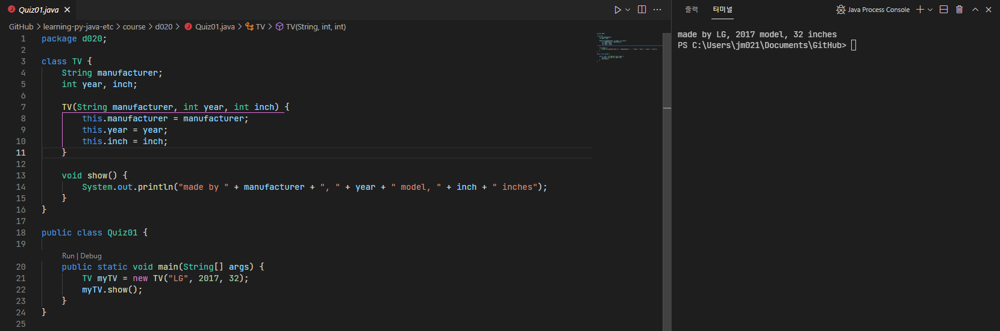

* [Quiz02.java](Quiz02.java)
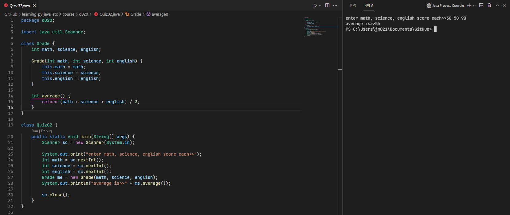

* [quiz03.java](quiz03.java)
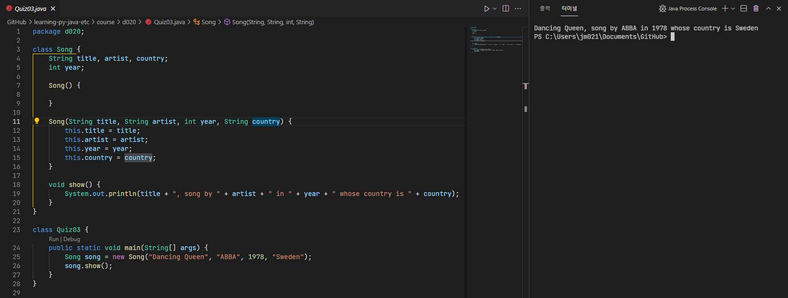

* [Quiz04.java](Quiz04.java)
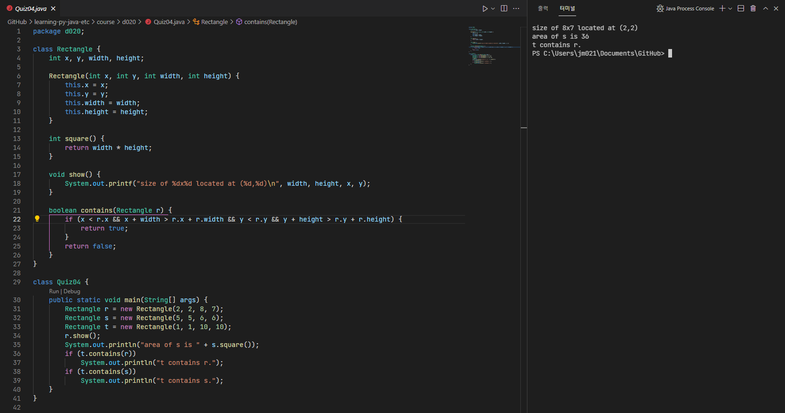

* [Quiz05.java](CircleManager.java)
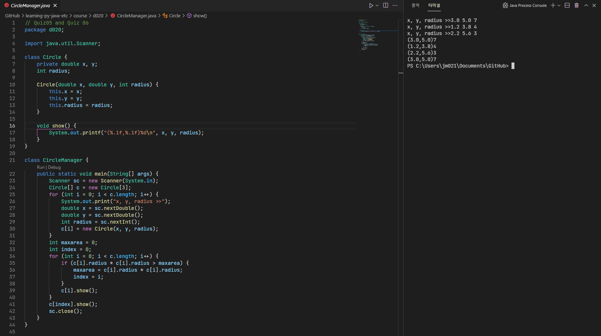

* [Quiz07.java](MonthSchedule.java)
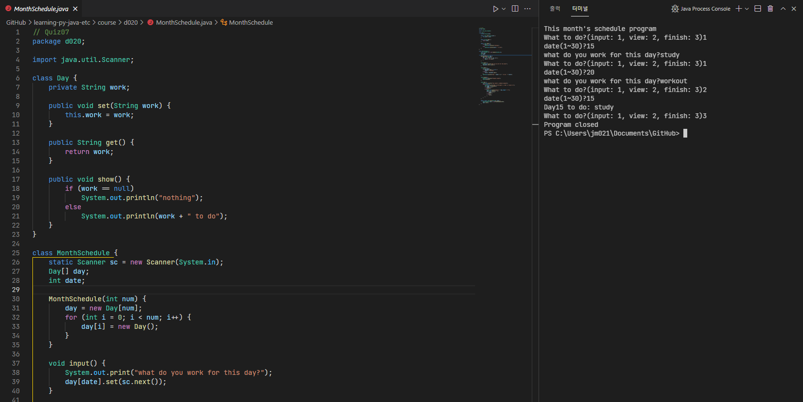
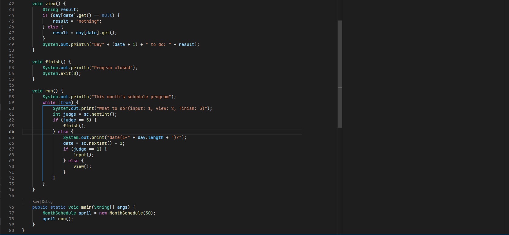

* [Quiz08.java](Quiz08.java)
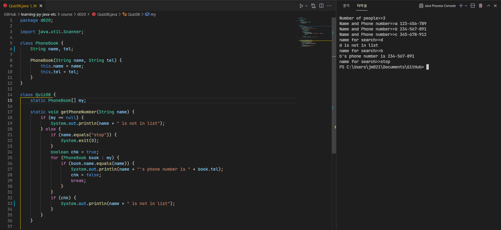
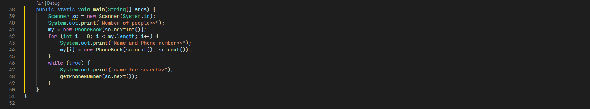

* [Quiz09.java](StaticEx.java)
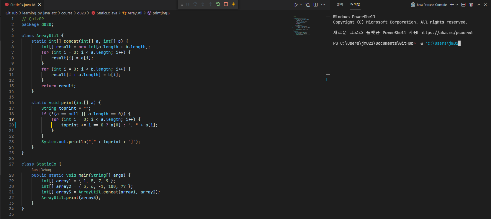

* [Quiz10.java](DicApp.java)
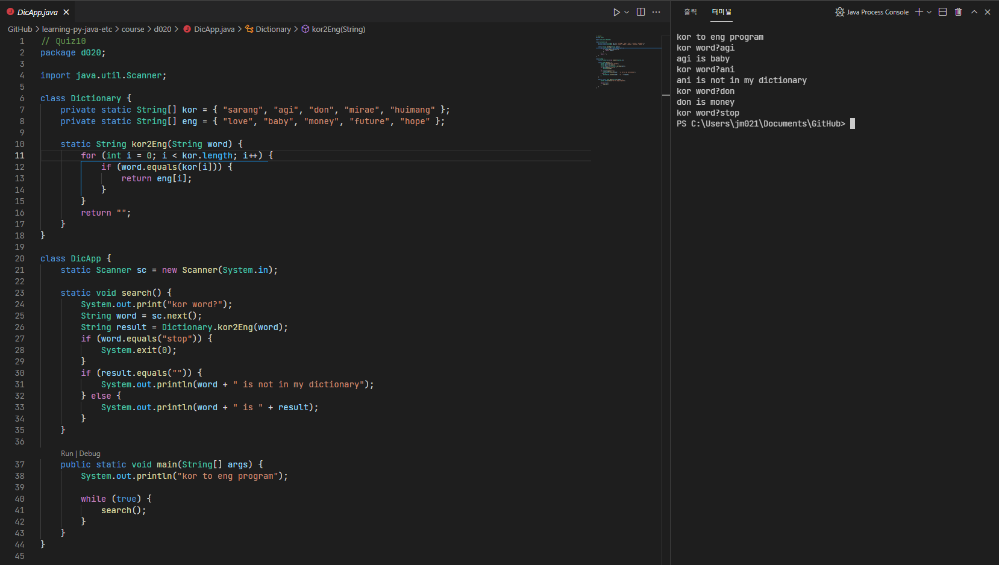

* [Quiz11.java](Quiz11.java)
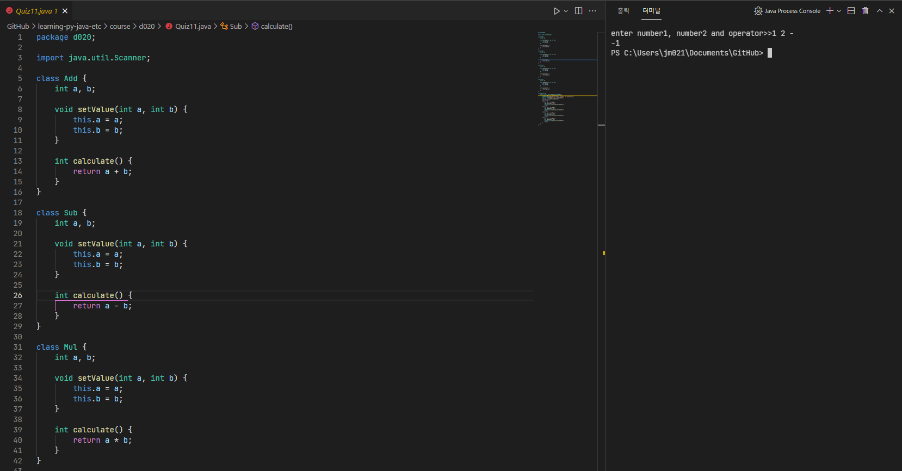
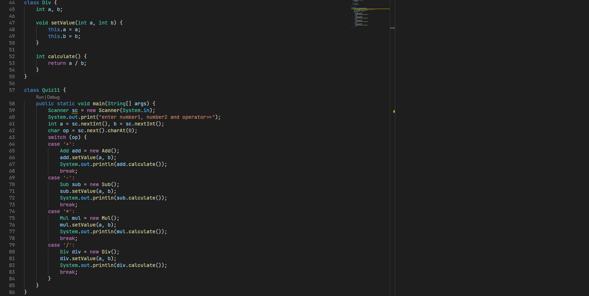

* [Quiz12.java](Quiz12.java)
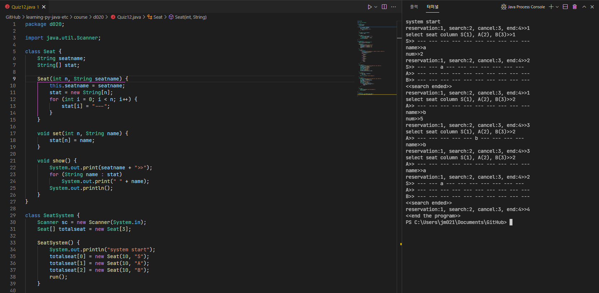
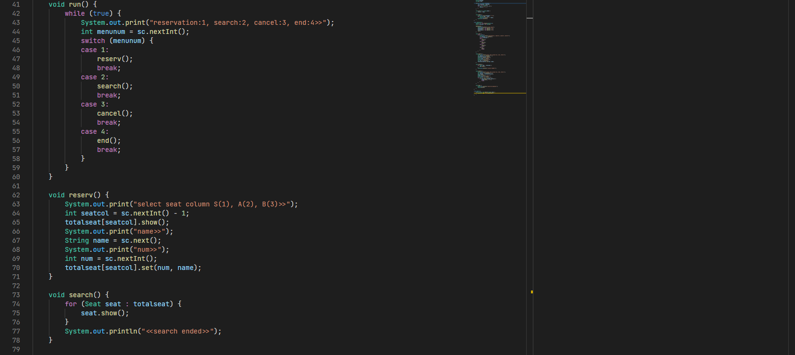
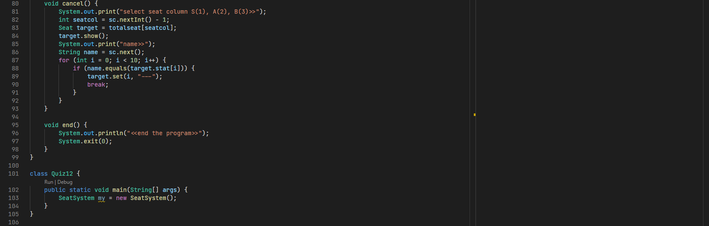

* [QuizOpen.java](WordGameApp.java)
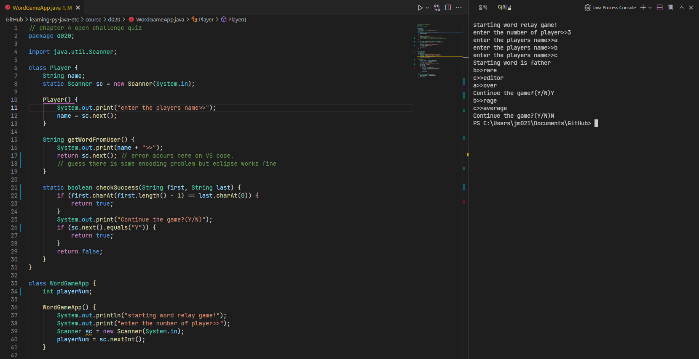
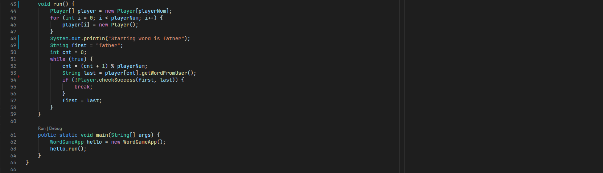
