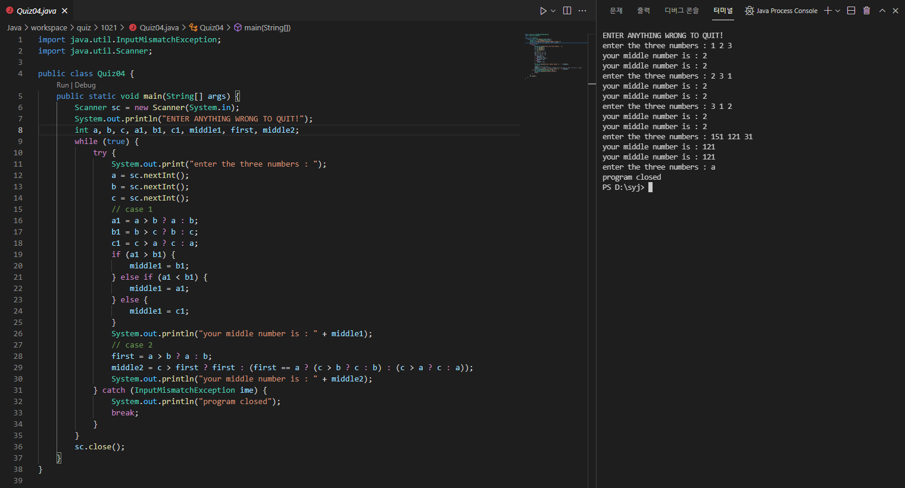
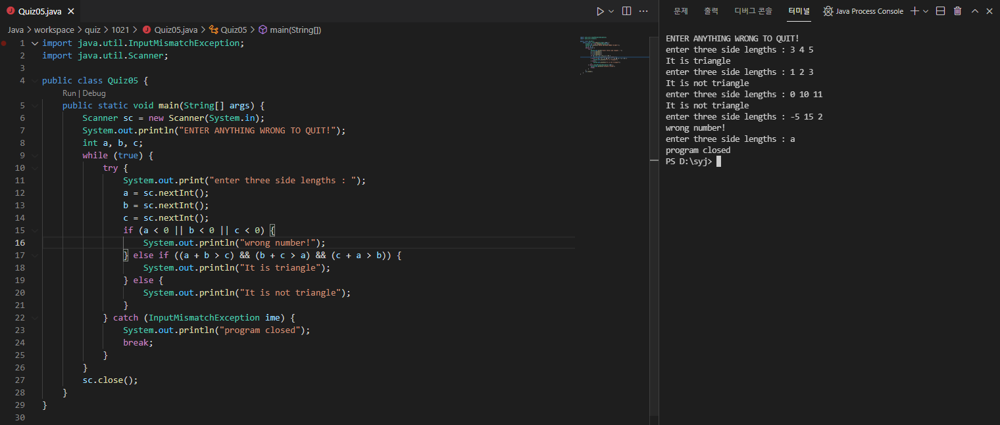
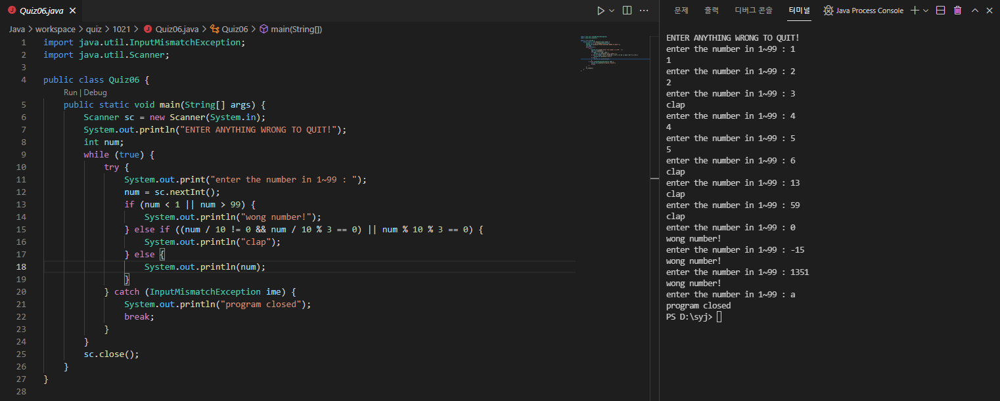
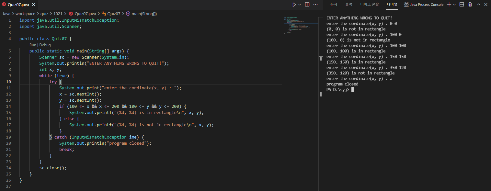
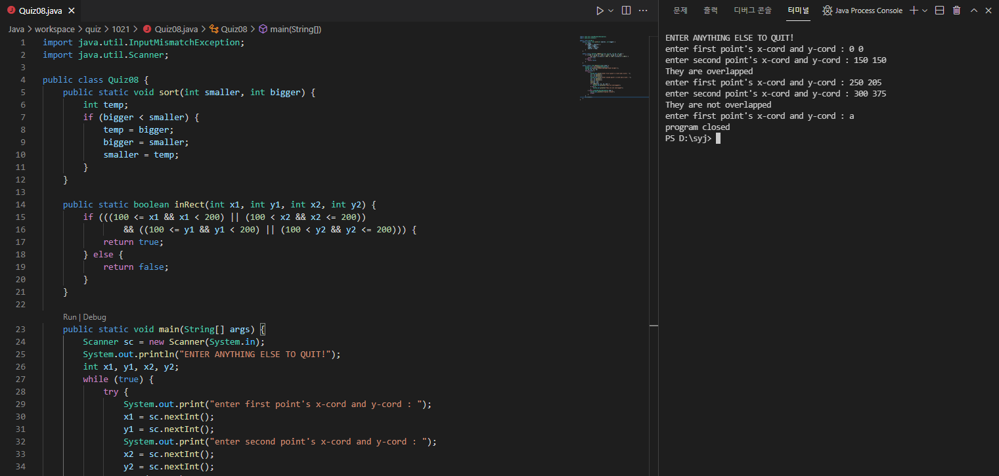
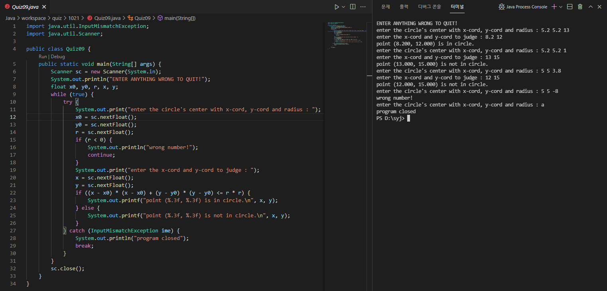
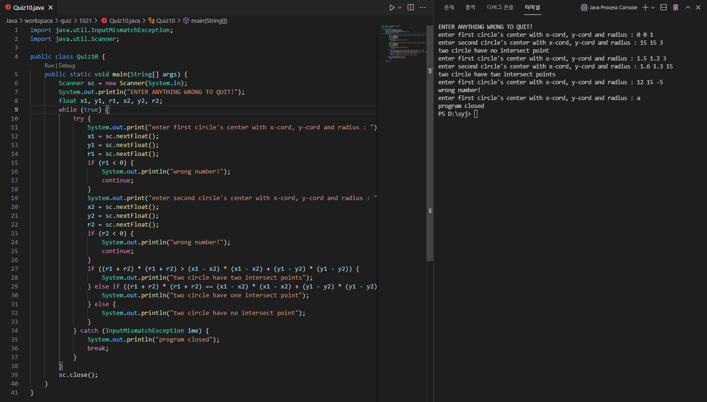
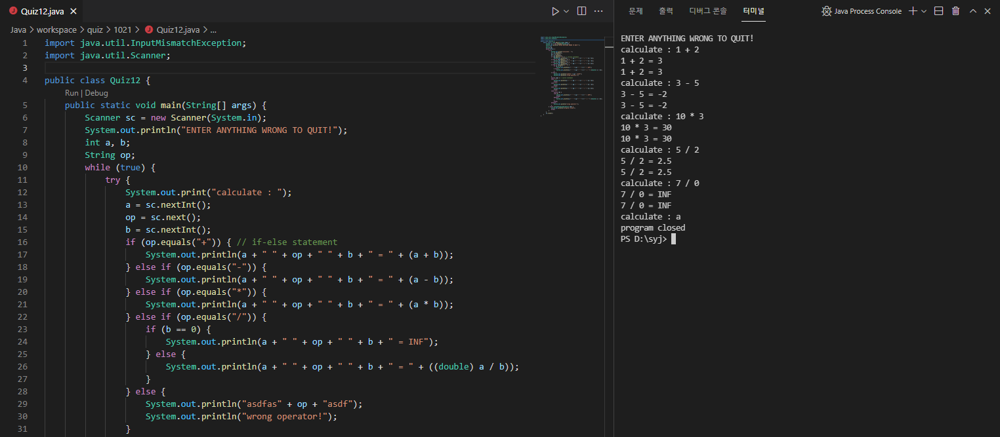

# 21/10/21 Java lesson

## What I learned(Important)

* if else statement

## What I studied myself

[more information](http://blog.naver.com/sharon0a/110046003657)

* RDBMS(Relational DataBase Management System)
    * can define only simple things like word, number, date and can't make new type
    * using SQL(Structured Query Language)
* ORDBMS(Object-Relational DataBase Management System)
    * can define new type by user
    * using extended SQL
    * slower than RDBMS dealing with data(searching, adding, ...etc.)
* OODBMS(Object-Oriented DataBase Management System)
    * can define new type and method by user
    * using OQL(Object Query Language)
    * a lot slower than RDBMS dealing with data(searching, adding, ...etc.)
* ORM(Object Relational Mapping)
    * Used to map between OOP(Object Oriented Programming) and RDBMS
    * I guess OODBMS doesn't need to use ORM

## What I didn't understand

## What I want to know more

* [making web system](https://pythonblog.co.kr/blog/61/) with Nginx(Web Server), Gunicorn(WSGI, same as Web Server
  Gateway Interface, Django(WAS, same as Web Application Server)
    * [more information for Web server, WSGI, WAS](https://jay-ji.tistory.com/66)
    * will add Database with(PostgreSQL(ORDBMS) or Mysql(RDBMS))

## etc(Additional)

## Practice problems

* [Quiz01.java](Quiz01.java)
  

* [Quiz02.java](Quiz02.java)
  

* [quiz03.java](quiz03.java)
  

* [Quiz04.java](Quiz04.java)
  

* [Quiz05.java](Quiz05.java)
  

* [Quiz06.java](Quiz06.java)
  

* [Quiz07.java](Quiz07.java)
  

* [Quiz08.java](Quiz08.java)
  
  

* [Quiz09.java](Quiz09.java)
  

* [Quiz10.java](Quiz10.java)
  

* [Quiz11.java](Quiz11.java)
  
  

* [Quiz12.java](Quiz12.java)
  
  

* [QuizOpen.java](QuizOpen.java)
  
