# 21/10/26 Java lesson

## What I learned(Important)

* for statement (example : [ForSample.java](ForSample.java), [NestedLoop.java](NestedLoop.java))
    * how to use:

  ```java
  for($inital-state$ ; $condition$ ; $state-change$) {
    $action$
  }
  ```

    * statement order:
        1. $initial-state$
        2. $condition$
        3. if true: $action$ -> $state-change$, if false: **ended**
        4. if **not ended**: go to 2.

* while statement (example : [WhileSample.java](WhileSample.java))
    * how to use:

  ```java
  while($condition$) {
    $action code$
  }
  ```

* do-while statement
    * how to use:

  ```java
  do {
    $action code$
  } while($condition$); // you MUST end with semicolon!
  ```

* continue and break
    * how to use:

* array

## What I studied myself

## What I didn't understand

* what is in array reference variable?
    * just memory location or plus array number
    * can overwrite other memory?

## What I want to know more

## etc(Additional)

## Practice problems
 
### ([Quiz01.java](Quiz01.java)) Sum 1~99 for different ways

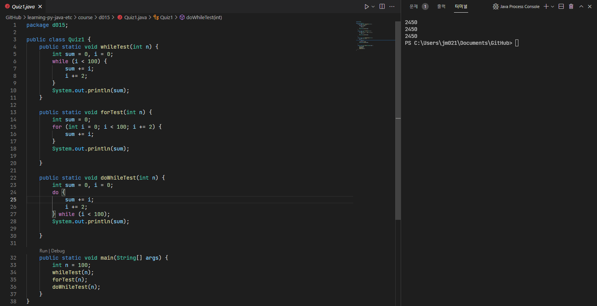

### ([Quiz02.java](Quiz02.java)) Make specific two-dimensional array

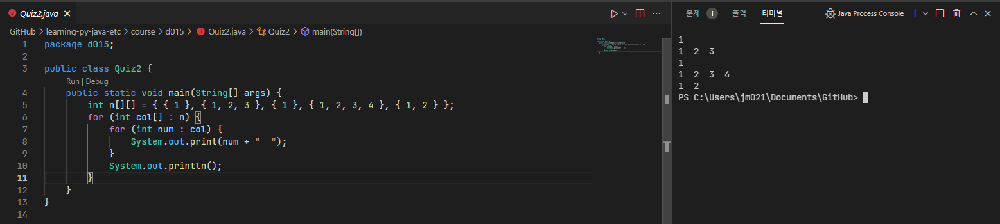

### ([quiz03.java](quiz03.java)) Make inverted pyramid stars for input number

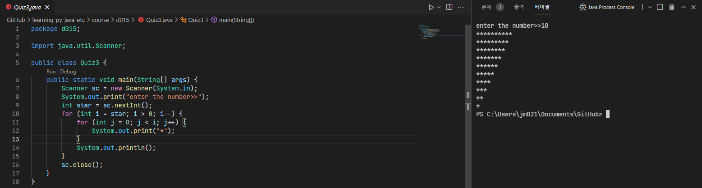

### ([Quiz04.java](Quiz04.java)) Make reducing inverted pyramid characters for input character

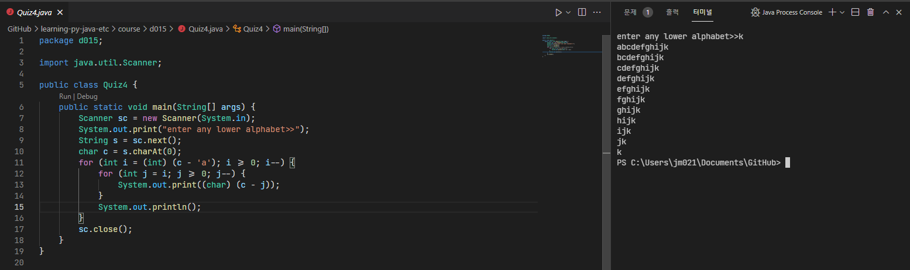

### ([Quiz05.java](Quiz05.java)) Search for multiples of 3

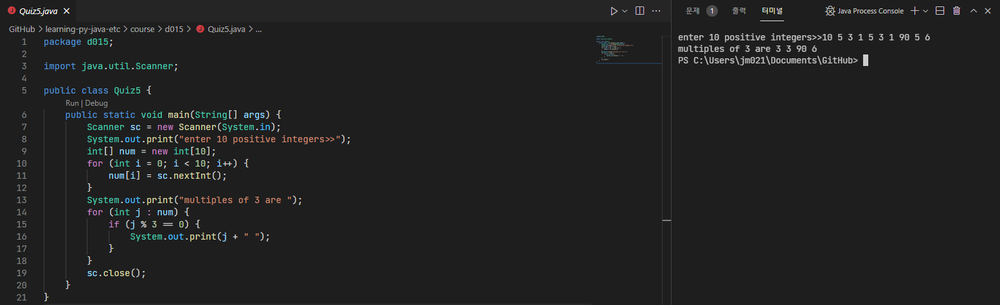

### ([Quiz06.java](Quiz06.java)) Divide money for given units

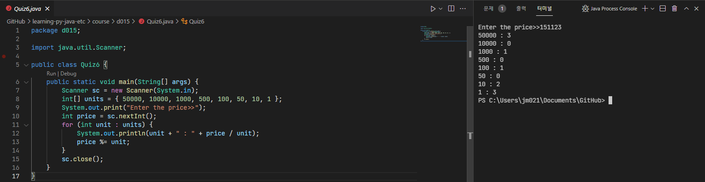

### ([Quiz07.java](Quiz07.java)) Evaluate average for random 10 numbers

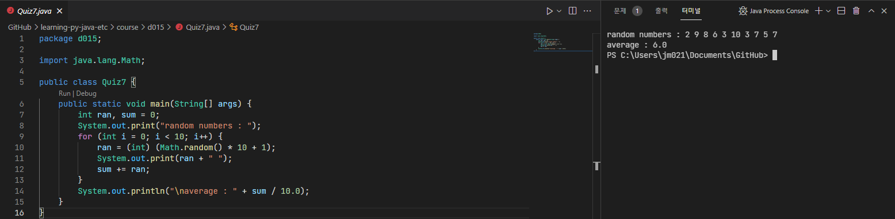

### ([Quiz08.java](Quiz08.java)) Make 10 random numbers that has no same number

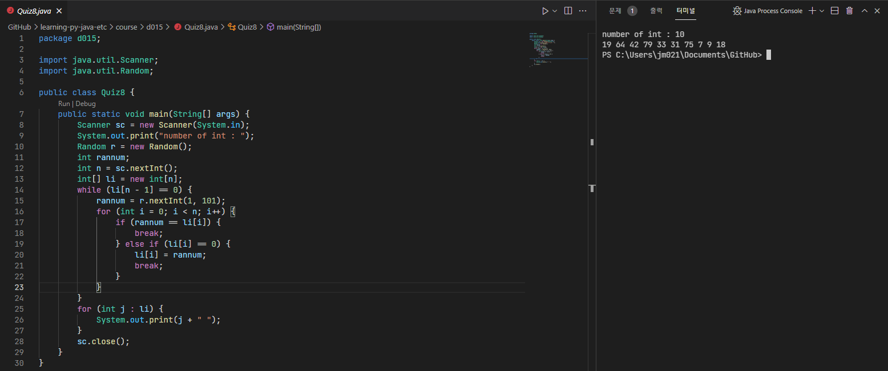

### ([Quiz09.java](Quiz09.java)) Make 4 by 4 array with random 16 numbers

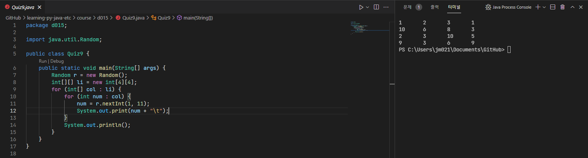

### ([Quiz10.java](Quiz10.java)) Make 4 by 4 array with random 10 numbers. blank was filled with 0

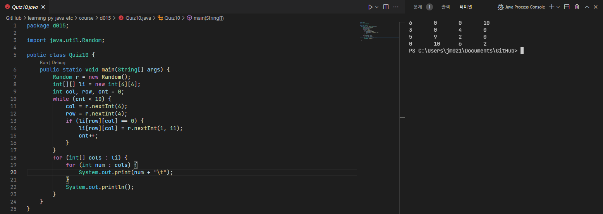

### ([Quiz11.java](Quiz11.java)) Run class file with average of input args

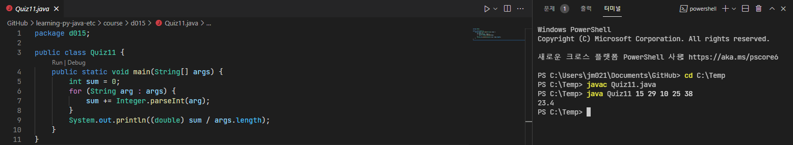

### ([Quiz12.java](Quiz12.java)) Run class file with sum of args that can converse to int

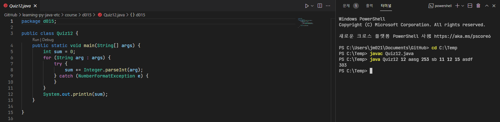

### ([Quiz13.java](Quiz13.java)) 369 game

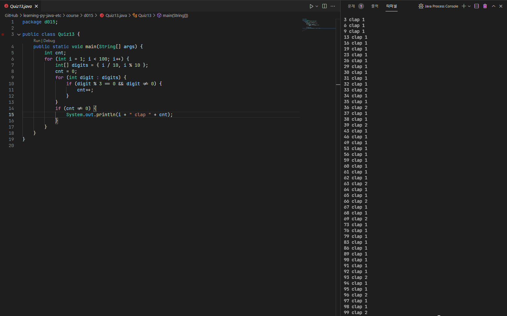

### ([Quiz14.java](Quiz14.java)) Matching input course with given score

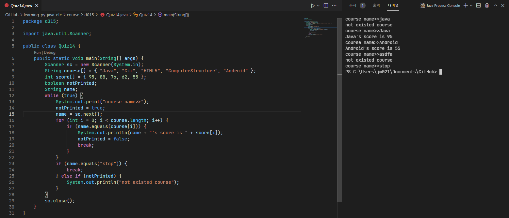

### ([Quiz15.java](Quiz15.java)) Evaluate only int sum

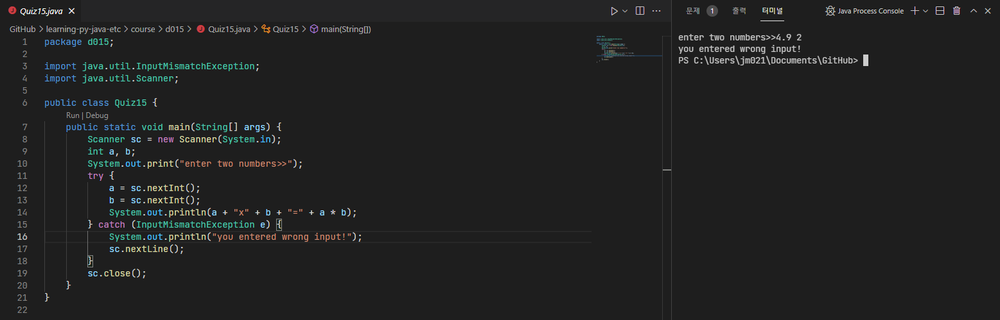

### ([Quiz16.java](Quiz16.java)) rock scissors paper game

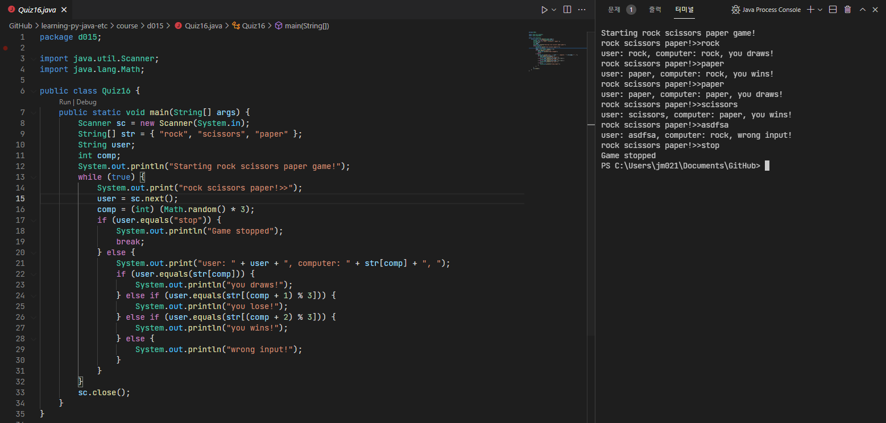

### ([QuizOpen.java](QuizOpen.java)) Number searching game

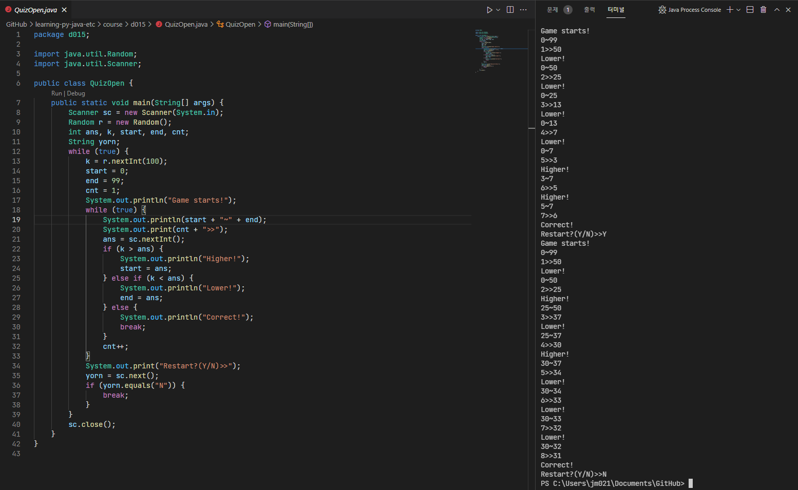
