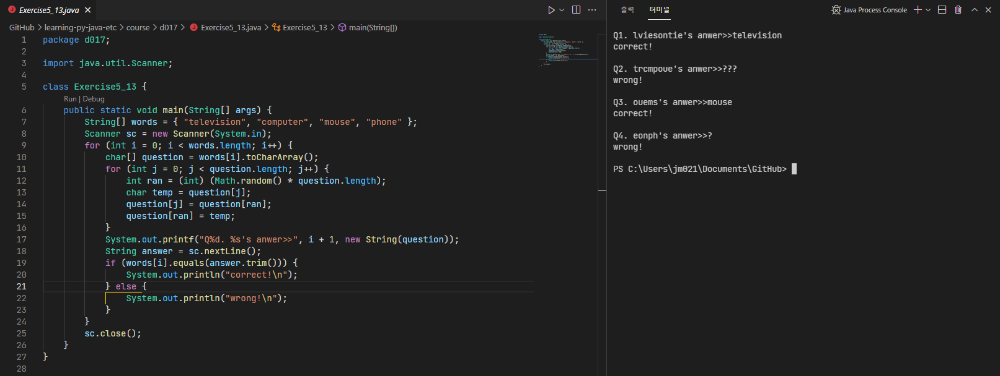

# 21/10/28 Java lesson

## What I learned(Important)

* class : what makes instance ([Circle.java](Circle.java))
  * instance : object made by class(with `new Class_name()` declare)
  * constructor : actual instance making source with initializing method and field with input parameter
  * member variable(or field) : all variables related with specific class
    * class variable : already maden variable without new instance declare. can make with using static keyword
    * instance variable : made same time with new instance declare
  * member method(or just method) : all functions related with specific class
    * class method : already maden method without new instance declare. can make with using static keyword
    * instance method : made same time with new instance declare
  * local variable : affects only in one constructor, method or loop and becomes dummy after
    * parameter : local variable that is used to declare input variable in constructor or method

* method overloading

## What I studied myself

## What I didn't understand

## What I want to know more

## etc(Additional)

## Useful links

<https://needjarvis.tistory.com/>

## Practice problems

### ([Exercise5_01.java](Exercise5_01.java)) Show how to declare variable

### ([Exercise5_02.java](Exercise5_02.java))

### ([Exercise5_03.java](Exercise5_03.java))

### ([Exercise5_04.java](Exercise5_04.java))

### ([Exercise5_05.java](Exercise5_05.java))

### ([Exercise5_06.java](Exercise5_06.java))

### ([Exercise5_07.java](Exercise5_07.java))

### ([Exercise5_08.java](Exercise5_08.java))

### ([Exercise5_09.java](Exercise5_09.java))

### ([Exercise5_10.java](Exercise5_10.java))

### ([Exercise5_11.java](Exercise5_11.java))

### ([Exercise5_13.java](Exercise5_13.java))

